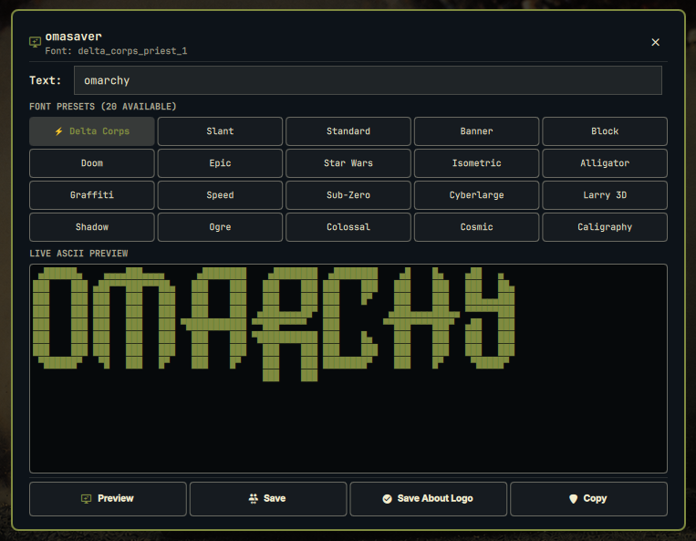

# 🎨 omasaver

> **A native Omarchy 4 bar widget and studio for live ASCII art generation, screensaver management (`ttfx`), and branding customization.**



`omasaver` transforms text into beautiful ASCII art instantly, integrating seamlessly into your Omarchy 4 desktop workflow and top bar. Easily generate, customize, preview, and sync your ASCII art across your Omarchy screensaver (`screensaver.txt`) and system about branding (`about.txt`).

---

## ✨ Features

- **🚀 Top Bar Widget:** Quick-access widget on your Omarchy bar (`󱄄 omasaver`) with live status.
- **⚡ Centered Studio Modal:**
  - Fast, responsive ASCII rendering as you type with auto-focus and full Wayland keyboard capture.
  - **20 curated font presets** in a 1-click grid, including Omarchy's signature `delta_corps_priest_1`, `slant`, `banner`, `doom`, `epic`, `starwars`, `cyberlarge`, and more.
  - Monospaced, scrollable live preview box.
- **👁️ Fullscreen Screensaver Preview:** Test the `ttfx` screensaver animation in full screen with one click, and automatically return to the studio when dismissed.
- **💾 1-Click System Branding Sync & Restore:**
  - **Save:** Update `~/.config/omarchy/branding/screensaver.txt` (with automatic `.bak` backup).
  - **Save About Logo:** Update `~/.config/omarchy/branding/about.txt` (Fastfetch/system branding).
  - **Restore Defaults:** 1-click restoration of Omarchy's original screensaver (`logo.txt`) and about logo (`icon.txt`).
- **📋 Clipboard Integration:** Instantly copy generated ASCII art to clipboard (`wl-copy` / `pyperclip`).
- **🛠️ Automation CLI:** Scriptable Python backend for shell scripts and system hooks.

---

## 📦 Installation

### Option 1: Via Omarchy Plugin Manager (Recommended)

```bash
omarchy plugin add https://github.com/jvlianodorneles/omasaver.git --enable --yes
```

### Option 2: Manual Installation

1. Clone into your Omarchy plugins directory:
   ```bash
   git clone https://github.com/jvlianodorneles/omasaver.git ~/.config/omarchy/plugins/dorneles.omasaver
   ```

2. Rescan and enable the plugin in Omarchy:
   ```bash
   omarchy-shell shell rescanPlugins
   omarchy plugin enable dorneles.omasaver
   ```

3. (Optional) Install Python dependencies:
   ```bash
   pip install -r ~/.config/omarchy/plugins/dorneles.omasaver/requirements.txt
   ```

---

## 🎮 Quick Controls

| Action | Control |
| :--- | :--- |
| **Open Studio Modal** | Click on `󱄄 omasaver` on the top bar |
| **Instant Screensaver Preview** | Middle-click on the top bar icon |
| **Close Studio** | Press `Esc` or click outside the card |

---

## ⌨️ CLI Usage

`omasaver` includes a command-line backend utility for terminal power users and automation scripts:

```bash
# Render ASCII art directly
python3 scripts/omasaver-ctl.py render "OMARCHY" delta_corps_priest_1 center

# Update Omarchy screensaver
python3 scripts/omasaver-ctl.py save-screensaver "OMARCHY" delta_corps_priest_1

# Update Omarchy about logo
python3 scripts/omasaver-ctl.py save-about "OMARCHY" delta_corps_priest_1

# Restore original Omarchy defaults
python3 scripts/omasaver-ctl.py restore-defaults

# Launch screensaver animation preview
python3 scripts/omasaver-ctl.py preview "OMARCHY" delta_corps_priest_1

# Copy rendered art to clipboard
python3 scripts/omasaver-ctl.py copy "OMARCHY" delta_corps_priest_1
```

---

## 🔗 Related Projects

- **[tuisaver](https://github.com/jvlianodorneles/tuisaver):** Standalone terminal TUI studio built with Python Textual.

---

## 🛠 Dependencies

- **[Omarchy 4](https://omarchy.org/)** (Quickshell / Qt6 QML)
- **[ttfx](https://github.com/ChrisBuilds/terminaltexteffects)** (Terminal text effects engine)
- **[Pyfiglet](https://github.com/patorjk/figlet.js)** (FIGlet ASCII engine)
- **[pyperclip](https://github.com/asweigart/pyperclip)** / `wl-copy` (Clipboard integration)

---

Built with ❤️ for [Omarchy](https://omarchy.org/).
